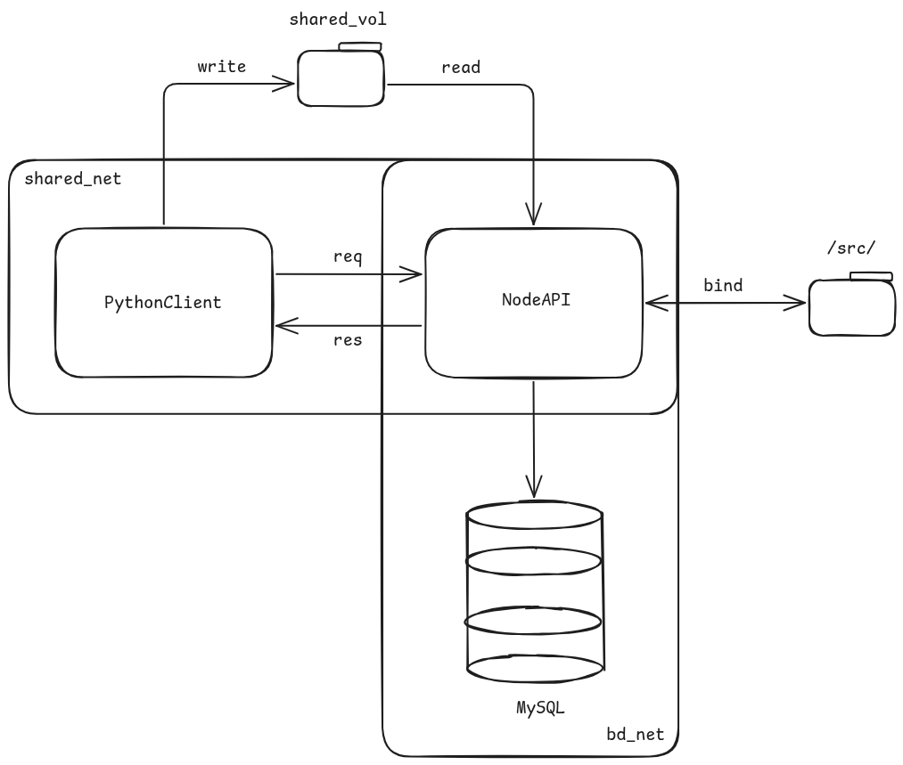

# Docker: Destaque-se no Mercado

Repositório de projeto fictício para ensinar conceitos da ferramenta Docker na Semana Acadêmica de 2025 da UFF.

## Objetivo

O projeto foi criado de forma a evidenciar conceitos de Docker.
Em sua estrutura, engloba:

- 3 contêineres: 2 com imagem própria (um com base em *node* e outro em *python:slim*) e 1 rodando a imagem *mysql*.
- 2 redes bridge, isolando diferentes contêineres.
- 1 volume nomeado, para compartilhamento de pasta.
- 1 bind mount, para facilitar o desenvolvimento com monitoramento ativo por nodemon.

Também se faz uso de arquivos .env, com conteúdo injetado pelo Docker.

> Obs.: As aplicações em si não têm propósito real. Portanto, algumas escolhas de desenvolvimento (como a organização de pastas e a pasta de logs) não representam casos de uso reais e podem não seguir boas práticas. Seu foco é didático somente.

## Estrutura do Projeto

### Diagrama

    </img>

### Explicação dos Componentes

<table border=1>
    <tr>
        <td>PythonClient</td>
        <td>Aplicação python com execuções em paralelo (usando MPI), para simular clientes realizando requisições ao servidor NodeAPI. A cada requisição, registra um log num arquivo compartilhado log.txt, acessado pelo servidor.</td>
    </tr>
    <tr>
        <td>NodeAPI</td>
        <td>Servidor Express.js escrito em Typescript, rodando em Node.js. Atende a uma requisição <code>GET /</code>, retornando um HTML; e a uma requisição <code>POST /user</code>, retornando um JSON de sucesso e registrando um usuário no banco de dados MySQL. A cada tanto tempo, conta quantas linhas há no arquivo log.txt, escrito por PythonClient.</td> 
    </tr>
    <tr>
        <td>MySQL</td>
        <td>Banco de dados MySQL, presente com imagem e contêiner de nome "db_service". Possui uma única tabela "users", em que registra usuários com um nome, e-mail e idade.</td>
    </tr>
    <tr>
        <td>shared_net</td>
        <td>Rede bridge compartilhada por PythonClient e NodeAPI. Evita que o servidor seja exposto externamente.</td>
    </tr>
    <tr>
        <td>bd_net</td>
        <td>Rede bridge compartilhada por NodeAPI e pelo BD. Evita exposição do BD externamente.</td>
    </tr>
    <tr>
        <td>shared_vol</td>
        <td>Volume nomeado usado como pasta compartilhada entre PythonClient e NodeAPI.</td>
    </tr>
    <tr>
        <td>/src/</td>
        <td>Bind mount que mapeia /NodeAPI/src/ no host para /src/ no contêiner NodeAPI. </td>
    </tr>
    
</table>

## Dockerização

O projeto apresenta duas formas de dockerização:

1. Por meio do `docker-compose.yaml`;
2. Por meio do arquivo `dockercli.sh`, que engloba comandos da CLI do Docker para criação do que for necessário.

Além dos arquivos `Dockerfile`, usados para criação das imagens.

> Se houver alguma falha após tentativas subsequentes, tente utilizar `docker compose down -v` para remover o que foi criado e tente novamente com `docker compose up --build`.